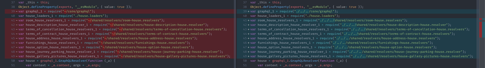

# Go TSPath [](https://travis-ci.org/joseluisq/go-tspath) [](https://codecov.io/gh/joseluisq/go-tspath) [](https://goreportcard.com/report/github.com/joseluisq/go-tspath) [](https://godoc.org/github.com/joseluisq/go-tspath)

> A fast [Typescript paths](https://www.typescriptlang.org/docs/handbook/module-resolution.html) replacer written in [Go](https://golang.org/). ⚡

**go-tspath** replaces directly [Typescript paths aliases](https://www.typescriptlang.org/docs/handbook/module-resolution.html) into JS files with real paths based on `tsconfig.json`, no more runtime replacers.



_Screenshot of `go-tspath` performing replacements in a Typescript code base project with more than 200 JS files and around 5857 lines of code._

## Status

**go-tspath** was tested replacing custom path aliases in a Typescript medium size project with desired results (shown in screenshot above).
But there are some features and more testing cases (community user feedback) to do.
So, It can considered as **Beta** yet. Contributions will be very appreciated.

## Installation

🚀 Download the latest **go-tspath** binary for your specific platform at [go-tspath/releases](https://github.com/joseluisq/go-tspath/releases).

## Usage

```sh
# 1. Build TS files via tsc
# 2. Replace TS paths
go-tspath -config=./tsconfig.replace.json
# 3. Just run your app
# node main.js
```

## Known limitations

- No support for JSON5 format of `tsconfig.json`. But works using a dedicated `tsconfig.json` file with your custom path aliases. See [`sample/tsconfig.replace.json`](https://github.com/joseluisq/go-tspath/blob/master/sample/tsconfig.replace.json)
- Limited `compilerOptions` settings. Only `baseUrl`, `paths` and `outDir` are supported. See [`CompilerOptions struct`](https://github.com/joseluisq/go-tspath/blob/master/pkg/tsconfig/tsconfig.go#L20).
- No support for `tsconfig.json` features like `extends`, `exclude` or similar.

## Typescript code example

See an example at [`sample`](https://github.com/joseluisq/go-tspath/tree/master/sample) directory.

## API

```sh
~> go-tspath --help
Usage of go-tspath:
  -config string
    	Specifies the Typescript configuration file. (default "./tsconfig.json")
```

## Contributions

Feel free to send some [Pull request](https://github.com/joseluisq/go-tspath/pulls) or [issue](https://github.com/joseluisq/go-tspath/issues).

## License

Licensed under either of

- Apache License, Version 2.0 ([LICENSE-APACHE](LICENSE-APACHE) or http://www.apache.org/licenses/LICENSE-2.0)
- MIT license ([LICENSE-MIT](LICENSE-MIT) or http://opensource.org/licenses/MIT)

at your option.

#### Contribution

Unless you explicitly state otherwise, any contribution intentionally submitted
for inclusion in the work by you, as defined in the Apache-2.0 license, shall be
dual licensed as above, without any additional terms or conditions.
